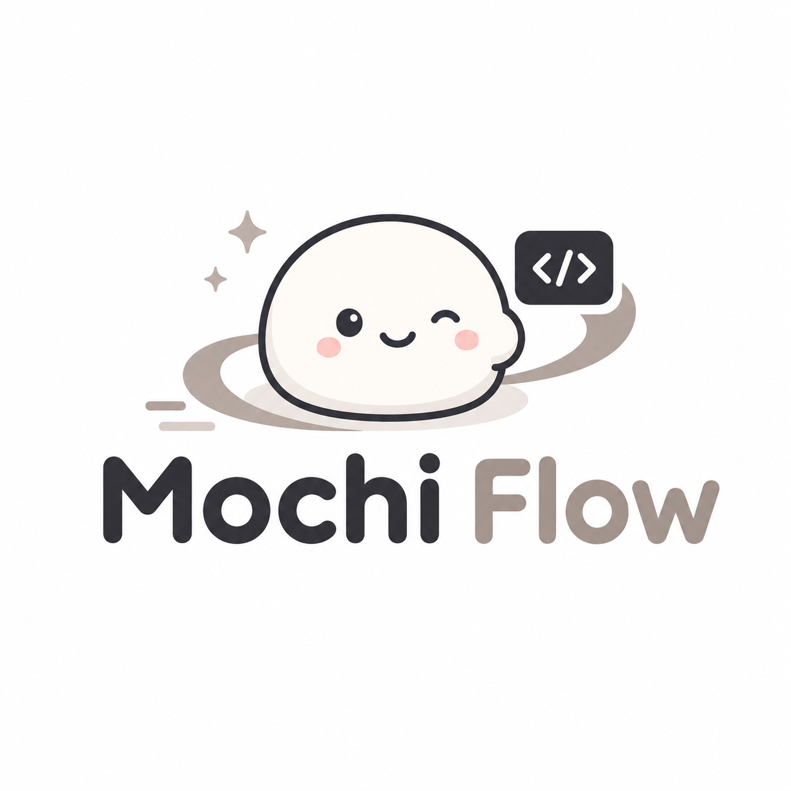

<p align="center">
  
</p>

# Contributing to MochiFlow

Thanks for your interest in contributing! This guide covers the dev setup,
the project's specific rules, and how to open a pull request.

By participating, you agree to abide by our [Code of Conduct](CODE_OF_CONDUCT.md).

## Development setup

MochiFlow's only implementation is the Rust CLI under `cli/`. You need the
Rust toolchain pinned by `rust-toolchain.toml` (edition 2024, Rust 1.96.0).

```bash
# Build
cargo build --manifest-path cli/Cargo.toml

# Run the full test + conformance suite (this is the canonical verify command)
cargo test --manifest-path cli/Cargo.toml

# Supply-chain / license checks
cargo deny --manifest-path cli/Cargo.toml check --config cli/deny.toml
```

The conformance suite (`cli/crates/mochiflow-cli/tests/conformance.rs`) is the
source of truth for behavior: JSON-schema accept/reject, `index` golden
equivalence, MANIFEST drift detection, the frozen-surface version gate, and
behavioral assertions for lint / doctor / config / adapter / upgrade. The
committed golden fixtures and schemas under `tests/` and `contracts/` back it.
A change is not done until `cargo test` passes.

## Where to make changes

Knowing which tree owns a file prevents the most common mistakes:

- **Engine source (edit here)** — repo-root `engine/` (`commands/`, `reference/`,
  `templates/`, `agents/`, `adapters/`). This is the project-agnostic core.
  Engine docs are written in **English** and carry no project-specific values;
  project specifics belong in `config.toml`.
- **Generated `MANIFEST.json`** — after editing any engine file, regenerate the
  manifest (it is a generated hash map, not hand-edited).
- **Vendored engine copy (never edit)** — `.mochiflow/engine/` is a gitignored
  install snapshot used by the dogfood run. It is synced from repo-root `engine/`
  via `mochiflow upgrade`; it is **not** the source.
- **Generated adapters (never hand-edit)** — tool entrypoints (`AGENTS.md`,
  `.kiro/`, `CLAUDE.md`, `.github/copilot-instructions.md`) are rendered from
  `engine/adapters/<tool>/*.tpl`. Edit the templates, then run
  `mochiflow adapter generate`.

## Contracts and the version gate

The contract surface is frozen by `contracts/contracts.lock`. If your change
touches a schema (`contracts/*.json`) or any other locked file, you must, **in
the same commit**:

1. regenerate `contracts.lock`, and
2. bump `engine/VERSION`.

This keeps the version gate honest — a schema change is never silently
unversioned. `schema_version` in `config.toml` breaks only on consumer-facing
file-format changes and is not manually bumped by users during normal upgrades;
see [contracts/VERSIONING.md](contracts/VERSIONING.md).

## Commit and pull request conventions

- Use [Conventional Commits](https://www.conventionalcommits.org/) for commit
  messages (`feat:`, `fix:`, `docs:`, `refactor:`, `chore:`, etc.).
- Keep changes focused; stage files explicitly rather than `git add .`.
- Make sure `cargo test --manifest-path cli/Cargo.toml` passes before opening a PR.
- Keep PR titles concise and describe what changed and why in the body. The PR
  template will prompt you for the details.
- Do not commit secrets (`.env`, credentials).

If you use MochiFlow itself to develop MochiFlow (it dogfoods), `git push` and
PR creation go through `mochiflow pr` — the single command that owns pre-flight,
the push, and backend resolution. You don't have to use it to contribute, but
direct `git push` to `main` is discouraged; open a feature branch and a PR.

## Reporting issues

Use the issue templates (bug report / feature request). For security
vulnerabilities, **do not** open a public issue — follow [SECURITY.md](SECURITY.md).

## License

By contributing, you agree that your contributions will be dual-licensed under
[MIT](LICENSE-MIT) and [Apache-2.0](LICENSE-APACHE), matching the project license.
