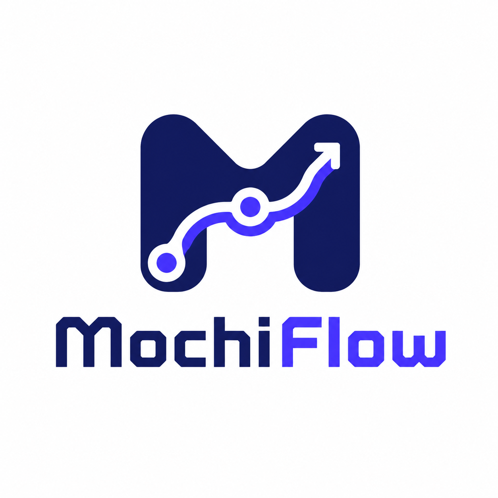

<p align="center">
  
</p>

<p align="center">
  AIコーディングエージェントに、相談・設計・実装・レビュー・PR作成の流れを渡す開発ワークフローツール。
</p>

<p align="center">
  <a href="#ライセンス"></a>
  <a href="CHANGELOG.md"></a>
  <a href="cli/Cargo.toml"></a>
</p>

<p align="center">
  <a href="README.md">English</a> | <b>日本語</b>
</p>

---

# MochiFlow

MochiFlowは、AIコーディングエージェントと一緒に開発を進めるための開発ワークフローツールです。

相談からPRまでの流れを、チャット履歴だけに頼らず進められます。AIエージェントがスコープを整理し、設計し、実装し、レビューし、次の作業に役立つ知識をリポジトリに残せます。

MochiFlowはAIモデルやAIランタイムではありません。
プロジェクトに `.mochiflow/` とAIツール向けの入口ファイルを追加する、Rust製の単一CLIです。

## MochiFlowでできること

- **いきなり実装しない**
  まずスコープ、受け入れ条件、設計方針を整理してから実装できます。

- **プロジェクトの記憶を残す**
  なぜその判断をしたのか、どこでハマりやすいのかをリポジトリに残せます。

- **文脈つきでレビューできる**
  spec、設計、実装、テスト、PR準備の抜けをAIに確認させられます。

- **PRまでつなげられる**
  実装、検証、レビュー対応、PR作成を同じ流れで進められます。

## クイックスタート

インストールします。

```bash
# Homebrew（macOS / Linux 推奨）
brew install ELUNOX/tap/mochiflow

# シェルインストーラ
curl --proto '=https' --tlsv1.2 -LsSf \
  https://github.com/ELUNOX/mochiflow/releases/download/v1.3.0/mochiflow-cli-installer.sh | sh

# ソースから
git clone https://github.com/ELUNOX/mochiflow.git
cd mochiflow
cargo install --path cli/crates/mochiflow-cli
```

新しいプロジェクトに導入します。

```bash
cd /path/to/project
mochiflow init
mochiflow doctor
```

すでにMochiFlowが入っているチームリポジトリに参加します。

```bash
git clone <repository-url>
cd <repository>
mochiflow join
mochiflow doctor
```

## ターミナルで使う主なコマンド

ターミナルで使う主なコマンドはこの4つです。

```bash
mochiflow init      # 新しいプロジェクトに導入
mochiflow join      # 既存プロジェクトのローカル状態を整える
mochiflow doctor    # 設定や生成物を確認
mochiflow status    # 現在の作業状況を見る
mochiflow inspect --json              # エージェント向けの読み取り専用リポジトリ情報
mochiflow inspect my-feature --json   # 仕様の詳細情報と実行可否
```

日々の開発は、ターミナルではなくAIコーディングツールとの会話で進めます。

## AIエージェントとの進め方

自然な言葉で始められます。

```text
検索画面に保存済みフィルタを追加したい。
いきなり実装せず、まずスコープ、エッジケース、設計を整理して。
```

続けて、こう頼めます。

```text
設計に進めて。
```

```text
この設計で実装して。
```

```text
PRを作成して。
```

段階を明確に指定したいときは、AIツールに次の合図を送れます。

| 合図 | 意味 |
| --- | --- |
| `mochiflow-discuss` | アイデア、スコープ、受け入れ条件を整理する |
| `mochiflow-plan` | spec、設計、作業リストを作る |
| `mochiflow-build` | 実装し、テストし、検証する |
| `mochiflow-review` | spec、設計、実装、PR準備をレビューし、結果だけを見る |
| `mochiflow-open` | PR作成に進む |
| `mochiflow-update` | PRフィードバックに対応し、再検証する |
| `mochiflow-close` | PRマージ後にローカルを片付ける |

これらはターミナルコマンドではありません。
AIコーディングツールに送るメッセージです。

## 判断、ハマりどころ、レビュー

MochiFlowは、変更の途中で決まったことや、次回また踏みそうな注意点をリポジトリ内に残します。

| 残すもの | 意味 |
| --- | --- |
| Decisions / ADR | なぜその設計・実装方針を選んだか |
| Pitfalls | 次回気をつけるべきハマりどころや失敗パターン |

ADRは、あとで読み返せる設計判断のメモです。
Pitfallsは、次のAIや開発者が同じ失敗を避けるための注意メモです。

これはMochiFlowの大きな価値です。一回のチャットで終わらせず、変更のたびにプロジェクトの知識を育てられます。

MochiFlowの観点でレビューを依頼することもできます。

```text
mochiflow-review
```

このレビューでは、specが曖昧でないか、設計と実装がずれていないか、受け入れ条件に対して検証が足りているか、PRに出せる状態かを確認します。通常のレビューは結果を見るだけで、ファイル編集、status変更、commit、push、PRメタデータ作成はしません。

レビュー結果をもとに自動修正まで任せたいときは、同じ `review` 系の合図で修正回数の上限を指定できます。

```text
saved-filters review fix
saved-filters review fix 2
saved-filters review fix 3
```

数字は最大の修正ラウンド数です。reviewer は read-only のままで、main agent が範囲内の修正だけを行い、指定した上限で止まります。review は品質確認の補助であり、追加の承認ゲートではありません。

## MochiFlowが作るもの

`mochiflow init` は、プロジェクトに `.mochiflow/` ワークスペースとAIツール向け入口ファイルを作成します。

```text
.mochiflow/
  config.toml        # プロジェクト設定
  engine/            # プロジェクトに同梱されるワークフローengine
  constitution.md    # 常に読み込まれるプロジェクトルール
  context/           # 現在のプロジェクト地図
  specs/             # ワークフローで作られるspec
  adr/               # 判断とハマりどころ
  instructions/       # 任意のユーザーMarkdown。通常のGit方針で共有候補
  instructions.local/ # 任意のユーザーMarkdown。デフォルトではローカル専用

AGENTS.md / CLAUDE.md / .kiro/ / .github/
  # AIコーディングツール用の入口ファイル
```

`.mochiflow/instructions/` と `.mochiflow/instructions.local/` の中身はユーザー所有のMarkdownです。MochiFlowはこれらを自動ロード、解析、索引化、検証、drift checkしません。AIエージェントに使わせたい場合は、依頼文でファイルパスを明示してください。

## Specの中身

specは、何を作るか、何を作らないか、どう確認するかを残すプロジェクト内のファイルです。

| ファイル | 役割 |
| --- | --- |
| `spec.md` | 何を作るか、何を範囲外にするか、どう確認するか |
| `design.md` | 技術方針、代替案、インターフェース、失敗時の扱い |
| `tasks.md` | AIエージェントが順番に実行できる作業リスト |
| AC Matrix | 受け入れ条件、実装、検証、証跡、結果の対応表 |

小さな修正では軽いspecで進められます。大きな変更では、必要に応じて設計や作業リストを詳しく残せます。

## その他のターミナルコマンド

基本の流れに慣れたあとで使うコマンドです。

```bash
mochiflow guide                        # AIツール向けの使い方カードを表示
mochiflow lint [--spec SLUG]           # specの整合性を確認
mochiflow config show                  # 解決済み設定を表示
mochiflow adapter generate [--check]   # AIツール入口ファイルを生成/確認
mochiflow index                        # 生成インデックスを更新
```

## 一時的に外す

MochiFlowの生成済みadapter内容とローカルstateだけを外し、プロジェクト知識とユーザーinstructionsを残したい場合は、次を実行します。

```bash
mochiflow detach
```

両方のinstructionsディレクトリを含むMochiFlowのプロジェクトデータをすべて削除したい場合だけ、確認フレーズ付きでpurgeします。

```bash
mochiflow detach --purge --confirm "delete mochiflow data"
```

## 対応AIツール

| AIツール | 連携方法 |
| --- | --- |
| Kiro | steeringファイルとレビュー用エージェント |
| Claude Code | `CLAUDE.md` |
| GitHub Copilot | `.github/` instructions |
| 汎用エージェント | `AGENTS.md` |

## さらに詳しく

- [Getting started](docs/getting-started.md)
- [Concepts](docs/concepts.md)
- [Configuration](docs/configuration.md)
- [Versioning](docs/versioning.md)
- [Release verification](docs/release-verification.md)
- [Changelog](CHANGELOG.md)

## コントリビュート

歓迎します。開発環境の構築・テスト・PRの作法は [CONTRIBUTING.md](CONTRIBUTING.md) を、コミュニティ規範は [行動規範](CODE_OF_CONDUCT.md) を参照してください。

## セキュリティ

脆弱性の報告手順は [SECURITY.md](SECURITY.md) を参照してください。

## ライセンス

[MIT](LICENSE-MIT) または [Apache-2.0](LICENSE-APACHE) のデュアルライセンスです。
好きな方を選択できます。

---

> 本READMEは英語版（[README.md](README.md)）と意味が対応する日本語版です。
