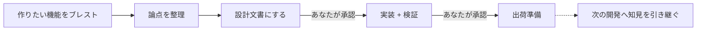

<p align="center">
  
</p>

<p align="center">
  AIコーディングエージェント向けのSpecワークフロー。
  相談、設計、実装、出荷準備までを、プロジェクト文脈を保ったまま進めます。
</p>

<p align="center">
  <a href="#ライセンス"></a>
  <a href="CHANGELOG.md"></a>
  <a href="cli/Cargo.toml"></a>
</p>

<p align="center">
  <a href="README.md">English</a> | <b>日本語</b>
</p>

---

MochiFlowは、AIコーディングエージェントのための仕様駆動ワークフローです。

Claude Code / Kiro / GitHub Copilot などのAIエージェントが、いきなり実装に入らず、
「相談 → 設計 → 実装 → 出荷準備」の流れで、文脈を保ちながら開発できるようにします。

* **作る前に整理する** — ざっくりした要望を、スコープのある仕様に落とします。
* **実装の先走りを防ぐ** — 実装前に設計承認、出荷前に確認ステップを挟みます。
* **知見を次へ引き継ぐ** — 判断やハマりどころを記録し、次の開発で参照します。

MochiFlowは、AIモデルやAIエージェントそのものではありません。
既存のAIコーディングツールに、プロジェクトごとの文脈、仕様作成フロー、承認ステップを渡すためのワークフローです。

外部ランタイムは不要です。
導入用のコマンドはRust製の単一バイナリとして動き、プロジェクト内にAIエージェント向けのワークフロー文脈を生成します。

## クイックスタート

MochiFlowの導入コマンドをインストールします。

```bash
# Homebrew（macOS / Linux 推奨）
brew install ELUNOX/tap/mochiflow

# シェルインストーラ
curl --proto '=https' --tlsv1.2 -LsSf \
  https://github.com/ELUNOX/mochiflow/releases/download/v1.1.2/mochiflow-cli-installer.sh | sh

# ソースから
git clone https://github.com/ELUNOX/mochiflow.git
cd mochiflow
cargo install --path cli/crates/mochiflow-cli
```

## 使い始める

MochiFlow の始め方は、ひとりで使う場合と、チームのリポジトリに参加する場合で少し違います。

### ひとりで使う場合

自分のプロジェクトに初めて MochiFlow を入れる場合は、プロジェクトのルートで `init` を実行します。

```bash
cd /path/to/project
mochiflow init
```

プロジェクト固有の確認が必要な場合、`init` は AI エージェントに貼るための文を表示します。
その文を Claude Code や Kiro などに渡すと、AI がコードベースを読み取り、MochiFlow の設定とプロジェクト文脈を整えます。

最後に状態を確認します。

```bash
mochiflow doctor
mochiflow index
```

`doctor` が通れば、AI ツールは MochiFlow の流れで動くための準備ができています。

### チームで使う場合

チームでは、最初に1人がリポジトリへ MochiFlow を導入します。
この人だけが `init` を実行します。

```bash
cd /path/to/project
mochiflow init
```

オンボーディングを完了したら、次のような共有ファイルをコミットします。

```text
.mochiflow/config.toml
.mochiflow/constitution.md
.mochiflow/context/
.mochiflow/specs/
.mochiflow/adr/
.mochiflow/INDEX.md
AGENTS.md / CLAUDE.md / .kiro/ / .github/
```

一方で、次のローカル生成ファイルはコミットしません。

```text
.mochiflow/engine/
.mochiflow/state/
.mochiflow/constitution.local.md
```

ほかのメンバーは、リポジトリを clone または pull したあと、`init` ではなく `join` を実行します。

```bash
mochiflow join
```

`join` は、このPCで必要なローカルファイルを復元し、AIツールの入口ファイルと `INDEX.md` も最新にします。
手書きの structured adapter ファイルだけは自動で上書きせず、candidate を出して手動統合を促します。

## `init` で何が作られるか

`mochiflow init` は、プロジェクトに `.mochiflow/` ワークスペースを追加し、
AIツールが読む入口ファイルを生成します。

```text
.mochiflow/
  config.toml        # プロジェクト設定、adapter、検証コマンド
  constitution.md    # あなたが書く、常に読み込まれるプロジェクトルール
  context/           # オンボーディング時にコードから埋める現在地マップ
  specs/             # ワークフローで作られる機能仕様
  adr/               # 次回以降に引き継ぐ判断・落とし穴

AGENTS.md / CLAUDE.md / .kiro/ / .github/
  # AIコーディングツール用に生成される入口ファイル
```

オンボーディングでは、AIエージェントがTODOを解決し、コードからproject contextを埋め、
adapterを再生成し、最後に `mochiflow doctor` で状態を確認します。

## MochiFlowを使うと、開発はこう進みます

たとえば「検索画面に保存済みフィルタを追加したい」とします。

AIツールには、自然な言葉でそのまま相談できます。

```text
検索画面に保存済みフィルタを追加したい。実装に入る前に、ブレストして。
```

段階を明確に指定したいときは、MochiFlowのトリガー語も使えます。

`mochiflow-discuss`、`mochiflow-plan`、`mochiflow-build`、`mochiflow-ship` は、
ターミナルで実行するコマンドではなく、AIツールに送るメッセージです。

```text
mochiflow-discuss 
検索条件を保存して、あとから再利用できる機能を作りたい。
```

どちらの書き方でも、同じ流れに乗ります。



方向性が見えたら、設計に進めます。

```text
mochiflow-plan
```

AIエージェントは `.mochiflow/specs/...` に設計文書を書き、あなたの承認を待ちます。
この時点ではまだ実装しません。

設計に納得したら、実装に進めます。

```text
mochiflow-build
```

AIエージェントは設計に沿って実装し、テストを追加・更新し、設定された検証コマンドを通します。

PRに出してよければ、出荷準備に進めます。

```text
mochiflow-ship
```

MochiFlowは今回の判断やハマりどころを記録し、プロジェクトのPR手順に沿って出荷を進めます。

## 対応AIエージェント

MochiFlowは、各AIコーディングツールが読み込める入口ファイルを生成し、
同じ仕様駆動ワークフローで開発できるようにします。

| AIエージェント       | 生成される入口     | 役割                      |
| -------------- | ----------- | ----------------------- |
| Kiro           | `.kiro/`    | 専用エージェント / steeringを生成  |
| Claude Code    | `CLAUDE.md` | プロジェクトルールとワークフローを読み込ませる |
| GitHub Copilot | `.github/`  | Copilot向けの指示ファイルを生成     |
| 汎用エージェント       | `AGENTS.md` | 汎用AIエージェント向けの入口を生成      |

導入時に `--adapter` で選択できます。あとから `mochiflow adapter generate`
で再生成できます。既存の Markdown 指示ファイルはカスタム内容を残したまま、
MochiFlow 管理ブロックだけが追加・更新されます。

## さらに詳しく

* [Getting started](docs/getting-started.md)
* [Concepts](docs/concepts.md)
* [Configuration](docs/configuration.md)
* [Versioning](docs/versioning.md)
* [Release verification](docs/release-verification.md)
* [Changelog](CHANGELOG.md)

## コントリビュート

歓迎します。開発環境の構築・テスト・PRの作法は [CONTRIBUTING.md](CONTRIBUTING.md) を、
コミュニティ規範は [行動規範](CODE_OF_CONDUCT.md) を参照してください。

## セキュリティ

脆弱性の報告手順は [SECURITY.md](SECURITY.md) を参照してください。

## ライセンス

[MIT](LICENSE-MIT) または [Apache-2.0](LICENSE-APACHE) のデュアルライセンスです。
好きな方を選択できます。

---

> 本READMEは英語版（[README.md](README.md)）と意味が対応する日本語版です。
