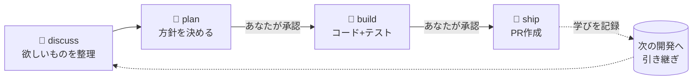

<p align="center">
  
</p>

<p align="center">
  AIコーディングエージェントに「思いつき」を渡すと、仕様の整理から設計・実装・PR作成までを、
  筋道立てて進めてくれる開発エンジン。
</p>

<p align="center">
  <a href="#ライセンス"></a>
  <a href="CHANGELOG.md"></a>
  <a href="cli/Cargo.toml"></a>
</p>

<p align="center">
  <a href="README.md">English</a> | <b>日本語</b>
</p>

---

AIにコードを書かせると、いきなり実装に走って脱線したり、前回の判断や落とし穴を忘れて
同じ失敗を繰り返したり、ツールごとに進め方がバラバラになったりします。
MochiFlowは、AIエージェントに **「議論 → 設計 → 実装 → 出荷」（discuss → plan → build → ship）**
という一定の進め方を与え、**やり取りの中で得た知見を次の開発へ引き継ぎ**、
**どのAIツールでも同じ流れ**で開発できるようにします。

## MochiFlowでできること

- 🗣 **アイデアを仕様に落とせる** — 「こんな機能が欲しい」と話すと、論点・トレードオフ・スコープを整理し、実装前に合意を取る。
- 🧭 **実装の暴走を止められる** — 勝手に最後まで進めず、「設計OK?」「PR出してOK?」の2回だけ人間に確認する。
- 🧠 **過去の判断を忘れさせない** — 「なぜそうしたか」「どこでハマったか」を出荷時に記録し、次回の開発で自動的に参照される。
- 🔁 **コードと知見がズレない** — プロジェクトの現状はコードから読み直すので、ドキュメントが古びても判断を誤らない。
- 🧩 **ツールを乗り換えても同じ流れ** — Kiro / Claude Code / GitHub Copilot / 汎用 `AGENTS.md` に、同一の進め方を自動で展開。
- ⚙️ **リスクに応じて厳しさを調整** — 影響の大きい変更ほどレビューやコミットの粒度を自動で厳しくする。
- 📦 **PR作成まで一気通貫** — `git push` やPR作成も含めて、安全な手順で出荷まで面倒を見る。

外部ランタイム不要。Rust製の単一バイナリで動きます。

## 使うとどうなるか

たとえば「ユーザー一覧にページングを追加したい」と伝えると、MochiFlowは:



1. **discuss（議論）** — ページングの要件・境界条件・既存実装との整合を一緒に詰める。
2. **plan（設計）** — 方針を提示し、あなたの承認を待つ（勝手に実装しない）。
3. **build（実装）** — コードとテストを書き、検証を通す。
4. **ship（出荷）** — PRを作成し、「なぜこの設計にしたか」を記録して次回に活かす。

人間が判断するのは ② と ④ の2回だけ。それ以外はMochiFlowが筋道を保ちます。

## クイックスタート

### インストール

Homebrew（推奨）:

```bash
brew install ELUNOX/tap/mochiflow
```

シェルインストーラ（Linux / macOS） — 正確なコマンドは
[最新リリース](https://github.com/ELUNOX/mochiflow/releases) からコピーしてください。
バージョンを固定する場合は、バージョン付き URL を使います。例:

```bash
curl --proto '=https' --tlsv1.2 -LsSf https://github.com/ELUNOX/mochiflow/releases/download/v1.1.0/mochiflow-cli-installer.sh | sh
```

ソースから（Rust ツールチェーンが必要）:

```bash
cargo install --path cli/crates/mochiflow-cli
```

> **macOS:** `brew` やシェルインストーラ経由のバイナリは Gatekeeper の警告なしに動きます。
> ブラウザでリリースの tarball を落として macOS にブロックされた場合は、一度だけ quarantine
> 属性を外してください: `xattr -d com.apple.quarantine ./mochiflow`。

### ダウンロードの検証（任意）

各リリースは SHA256 チェックサムと SLSA build provenance を同梱します:

```bash
# 整合性
shasum -a 256 -c mochiflow-cli-<target>.tar.xz.sha256
# provenance（GitHub CLI が必要）
gh attestation verify mochiflow-cli-<target>.tar.xz --repo ELUNOX/mochiflow
```

### プロジェクトに導入

```bash
cd /path/to/project
mochiflow init
```

`init` は対話端末では adapter と project language を質問します。adapter の既定は
`agents`、language の既定は locale 由来です（日本語 locale なら `ja`、それ以外は `en`）。
CI やスクリプトでは `mochiflow init --yes` を使うと質問せず、同じ locale 由来の language
既定値と検出値で進み、曖昧な項目だけレビュー対象として残します。明示する場合は
`mochiflow init --language ja` または `mochiflow init --language en` を使います。

結果が `Ready` なら config / context / adapter がすべて使える状態です。`Needs AI review`
の場合は、`init` が表示する exact prompt をそのまま AI エージェントに貼ってください。
`# mochiflow: confirm` / `TODO` の解決、コードからの context 補完、adapter 再生成、
`mochiflow doctor` まで含まれます。`Blocked` の場合は既存の手書き adapter ファイルに
candidate の手動統合が必要で、スクリプトでも検知できるよう `init` は `1` で終了します。

`Needs AI review` の next step 例:

```text
AI アシスタントにこの文を貼ってください:

MochiFlow の初期設定を完成させてください。.mochiflow/config.toml を読み、
"# mochiflow: confirm" と TODO の項目を私と確認し、
.mochiflow/context/product.md、.mochiflow/context/structure.md、.mochiflow/context/tech.md をコードから埋め、
必要なら surfaces / verify / write scope / git 設定を調整し、
adapter を再生成して、最後に mochiflow doctor を通してください。
```

あとは、いつものAIツールに「〇〇を実装したい」と話しかけるだけ。MochiFlowが進め方を整えます。

## 対応ツール

| ツール | 連携方法 |
| --- | --- |
| Kiro | 専用エージェント / ステアリングを自動生成 |
| Claude Code | `CLAUDE.md` を自動生成 |
| GitHub Copilot | `.github/` 連携を自動生成 |
| 汎用エージェント | `AGENTS.md` を自動生成 |

導入時に `--adapter` で選択（複数指定 / カンマ区切り可）。`codex` は中立な `agents`
アダプタへ解決されるエイリアスです。あとから `mochiflow adapter generate` で再生成できます。

## さらに詳しく

<details>
<summary>仕組みと用語（クリックで展開）</summary>

MochiFlowは4つの段階（**verb**: discuss / plan / build / ship）でAIを駆動します。
得た知見は **living spec** に蓄積され、「なぜ」は出荷時に追記（**fold**）、
プロジェクトの現状マップが古くなったときは、AIエージェントがコードから再生成（**refresh**）できます。
変更には影響度（**risk**: `standard` / `elevated` / `critical`）が割り当てられ、
レビュー頻度やコミット粒度が変わり、ツール連携の出力（**adapter**）は1つの設定から生成されます。

中核となる不変条件:

- コードが現状の唯一のソース。散文がコードを上書きしない。
- 人間の承認ゲートは2つだけ（build承認・PR承認）。変更を `done` にできるのは `ship` のみ。
- `git push` とPR作成は必ず `mochiflow pr` 経由。
- 契約面は `contracts.lock` で凍結。スキーマ変更にはロック再生成と `engine/VERSION` の更新を同一コミットで要求。

CLIコマンド:

```
mochiflow init | config | lint | doctor | adapter | index | ready | backlog | upgrade | completions | pr
```

</details>

<details>
<summary>設定・gitignore・エンジンの更新</summary>

### 設定

`mochiflow init` は `<target>/.mochiflow/` にスキーマ準拠のスケルトンを書き出し、
ソースツリーには触れません。`Ready` は config / context / adapter がすべて完成している
場合だけです。プロジェクト固有の判断が必要なら `Needs AI review` になります。その場合は
`init` が表示する prompt を AI エージェントに渡し、`.mochiflow/config.toml` の解決、
`.mochiflow/context/product.md`・`.mochiflow/context/structure.md`・
`.mochiflow/context/tech.md` のコード由来の補完、adapter 再生成、`mochiflow doctor`
まで実行させます。adapter ファイルの手動統合が
必要な場合は `Blocked` になり、`init` は `1` で終了します。

非対話で導入する場合:

```bash
mochiflow init --yes
```

質問なしで言語を明示する場合:

```bash
mochiflow init --language ja
```

### gitignoreの指針

原則は「再生成・実行時派生 → 無視 / 著作された知見 → 追跡」です。

```gitignore
# 再生成・実行時 — 追跡しない
.mochiflow/engine/   # ベンダリングされたエンジンの複製（init/upgradeで復元）
.mochiflow/state/    # 実行時派生の状態
```

残り（`.mochiflow/config.toml`・`.mochiflow/specs/`・`.mochiflow/context/`・
`.mochiflow/adr/`・`.mochiflow/INDEX.md`）は追跡対象です。

### エンジンの更新

```bash
# 対象プロジェクトのルートから
mochiflow upgrade
mochiflow doctor
```

インストール済み CLI を更新したあと、`mochiflow upgrade` は CLI に同梱された engine を
プロジェクトのベンダリング済み engine へ展開し、adapter を再生成します。
`config.toml`・specs・living spec は保持されます。`--source /path/to/engine` は開発・
dogfood 用の明示指定です。インストール済み engine 自身の `VERSION` と `MANIFEST.json` が、
利用中の engine 版と整合性の基準を記録します。バージョンごとの移行注記は
[CHANGELOG.md](CHANGELOG.md) を参照してください。

</details>

<details>
<summary>ディレクトリ構成とバージョニング</summary>

```
cli/           # Rust CLIワークスペース（mochiflow-cli + mochiflow-core）
engine/        # プロジェクト非依存のコア（commands/reference/templates/agents/adapters）
contracts/     # 凍結スキーマ（config / spec.yaml v1 / MANIFEST）+ セマンティクス
tests/         # コンフォーマンス（golden fixtures + schema fixtures、cargo testが消費）
```

- `mochiflow --version` — 製品 / CLI のバージョン。
- `engine/VERSION` — source engine と contract surface の semver。
- `.mochiflow/engine/VERSION` — adapter・`config show`・`doctor engine` が読むインストール済み engine 版。
- `.mochiflow/engine/MANIFEST.json` — インストール済み engine の整合性基準。`version` は同じ engine の `VERSION` と一致します。
- `config.toml` の `schema_version` — config ファイル形式の互換性番号。通常の更新で利用者が手編集するものではありません。

</details>

## コントリビュート

歓迎します。開発環境の構築・テスト・PRの作法は [CONTRIBUTING.md](CONTRIBUTING.md)
を、コミュニティ規範は [行動規範](CODE_OF_CONDUCT.md) を参照してください。

## セキュリティ

脆弱性の報告手順は [SECURITY.md](SECURITY.md) を参照してください。

## ライセンス

[MIT](LICENSE-MIT) または [Apache-2.0](LICENSE-APACHE) のデュアルライセンス。
お好きな方を選択できます。

---

> 本READMEは英語版（[README.md](README.md)）を一次ソースとするミラーです。
> 変更するときは両言語を同時に更新してください。
