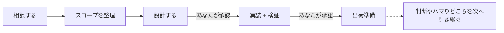

<p align="center">
  
</p>

<p align="center">
  AIコーディングエージェントに、相談・設計・実装・出荷準備の流れを渡すSpecワークフロー。
</p>

<p align="center">
  <a href="#ライセンス"></a>
  <a href="CHANGELOG.md"></a>
  <a href="cli/Cargo.toml"></a>
</p>

<p align="center">
  <a href="README.md">English</a> | <b>日本語</b>
</p>

---

# MochiFlow

MochiFlowは、AIコーディングエージェントのための仕様駆動ワークフローです。

Claude Code、Kiro、GitHub CopilotなどのAIツールに、プロジェクト文脈・仕様作成フロー・承認ステップを読み込ませ、AIがいきなり実装へ進まず、合意された設計に沿って変更を進められるようにします。

MochiFlow自体はAIモデルやAIランタイムではありません。
プロジェクト内に `.mochiflow/` とAIツール向けの入口ファイルを生成する、Rust製の単一バイナリです。

## 30秒ガイド

MochiFlowでは、導入や状態確認はターミナルで行い、日々の開発はAIツールとの会話で進めます。

| やりたいこと | 使うもの |
| --- | --- |
| 新しいプロジェクトに導入する | ターミナルで `mochiflow init` |
| チームの既存リポジトリに参加する | ターミナルで `mochiflow join` |
| 状態を確認する | ターミナルで `mochiflow doctor` |
| 要件やスコープを相談する | AIツールに自然に相談、または `mochiflow-discuss` |
| 設計文書を作る | AIツールに「設計に進めて」、または `mochiflow-plan` |
| 実装して検証する | AIツールに「実装して」、または `mochiflow-build` |
| PR準備をする | AIツールに「出荷準備して」、または `mochiflow-ship` |

`mochiflow-discuss`、`mochiflow-plan`、`mochiflow-build`、`mochiflow-ship` はターミナルで実行するコマンドではありません。
AIツールに段階を明確に伝えたいときのメッセージです。

トリガー語は必須ではありません。普段は自然な言葉で相談し、段階を明確に指定したいときだけ使えます。

## インストール

```bash
# Homebrew（macOS / Linux 推奨）
brew install ELUNOX/tap/mochiflow

# シェルインストーラ
curl --proto '=https' --tlsv1.2 -LsSf \
  https://github.com/ELUNOX/mochiflow/releases/download/v1.1.3/mochiflow-cli-installer.sh | sh

# ソースから
git clone https://github.com/ELUNOX/mochiflow.git
cd mochiflow
cargo install --path cli/crates/mochiflow-cli
```

## 使い始める

MochiFlowの始め方は、リポジトリに初めて導入する場合と、すでにMochiFlowが入っているチームリポジトリに参加する場合で違います。

### 新しいプロジェクトに導入する

自分のプロジェクトに初めてMochiFlowを入れる場合は、プロジェクトのルートで `init` を実行します。

```bash
cd /path/to/project
mochiflow init
```

`init` は `.mochiflow/` ワークスペース、vendored engine、AIツール向け入口ファイルを作成します。

プロジェクト固有の判断が必要な場合、`init` はAIエージェントに貼るための文を表示します。
その文をClaude Code、Kiro、GitHub Copilotなどに渡すと、AIがコードベースを読み取り、MochiFlowの設定とプロジェクト文脈を整えます。

最後に状態を確認します。

```bash
mochiflow doctor
mochiflow index
```

`doctor` が通れば、AIツールはMochiFlowの流れで動く準備ができています。

### チームの既存リポジトリに参加する

すでにMochiFlowが導入されているチームリポジトリでは、通常 `init` を再実行しません。

リポジトリをcloneまたはpullしたあと、必要に応じて `join` を実行します。

```bash
git clone <repository-url>
cd <repository>
mochiflow join
```

`join` は、このPCで必要なローカルstateを復元し、adapterや `INDEX.md` を最新にします。
古い、または壊れた作業ツリーでは `.mochiflow/engine/` も復元できます。

手書きのstructured adapterファイルは自動で上書きせず、candidateを出して手動統合を促します。

## 日々の開発フロー

MochiFlowの中心は、ターミナルコマンドではなくAIツールとの会話です。

自然な言葉で相談しても、明示的なトリガー語を使っても、同じMochiFlowの流れに入れます。



### 1. 相談する

まずは普通にAIツールへ相談できます。

```text
検索画面に保存済みフィルタを追加したい。
いきなり実装せず、まずスコープ、エッジケース、設計案を一緒に整理して。
```

段階を明確にしたいときは、トリガー語を使えます。

```text
mochiflow-discuss

検索画面に保存済みフィルタを追加したい。
```

AIエージェントは、要件、制約、影響範囲、未決事項を整理します。

### 2. 設計する

方向性が見えたら、設計に進めます。

```text
設計に進めて。
```

または、明示的に指定できます。

```text
mochiflow-plan
```

AIエージェントは `.mochiflow/specs/{slug}/` に設計文書を書きます。
この時点ではまだ実装しません。あなたの承認を待ちます。

### 3. 実装する

設計に納得したら、実装に進めます。

```text
この設計で実装して。
```

または、明示的に指定できます。

```text
mochiflow-build
```

AIエージェントは承認済みの設計に沿って実装し、テストを追加・更新し、設定された検証コマンドを実行します。

### 4. 出荷準備する

PRに出してよければ、出荷準備に進めます。

```text
出荷準備して。
```

または、明示的に指定できます。

```text
mochiflow-ship
```

MochiFlowは今回の判断やハマりどころを記録し、プロジェクトのPR手順に沿って出荷を進めます。

## MochiFlowが作るファイル

`mochiflow init` は、プロジェクトに `.mochiflow/` ワークスペースとAIツール向け入口ファイルを作成します。

```text
.mochiflow/
  config.toml        # プロジェクト設定、adapter、検証コマンド
  engine/            # プロジェクトに同梱されるワークフローengine
  constitution.md    # 常に読み込まれるプロジェクトルール
  context/           # コードから埋める現在地マップ
  specs/             # ワークフローで作られる機能仕様
  adr/               # 次回以降に引き継ぐ判断・落とし穴
  INDEX.md           # specs / adr / context の索引

AGENTS.md / CLAUDE.md / .kiro/ / .github/
  # AIコーディングツール用に生成される入口ファイル
```

チームで使う場合、次のような共有ファイルはコミットします。

```text
.mochiflow/config.toml
.mochiflow/constitution.md
.mochiflow/context/
.mochiflow/specs/
.mochiflow/adr/
.mochiflow/INDEX.md
.mochiflow/engine/
AGENTS.md / CLAUDE.md / .kiro/ / .github/
```

一方で、次のローカル生成ファイルは通常コミットしません。

```text
.mochiflow/state/
.mochiflow/constitution.local.md
```

## Specの中身

通常の変更では、specは `.mochiflow/specs/{slug}/` の下に作られます。
小さな修正では、必要な分だけ軽く使えます。

| ファイル | 役割 |
| --- | --- |
| `spec.md` | 何を作るか、何を範囲外にするか、どう確認するか |
| `design.md` | 技術方針、代替案、インターフェース、失敗時の扱い |
| `tasks.md` | AIエージェントが順番に実行できる作業リスト |
| AC Matrix | 受け入れ条件、実装、検証、証跡、結果の対応表 |

MochiFlowはチャット履歴ではなく、リポジトリ内のファイルに状態を残します。
そのため、次の開発でも過去の判断やハマりどころを参照できます。

## 対応AIツール

MochiFlowは、各AIコーディングツールが読み込める入口ファイルを生成します。

| AIツール | 生成される入口 | 役割 |
| --- | --- | --- |
| Kiro | `.kiro/` | 常時読み込みsteering + 読み取り専用レビューア; 権限は `permissions.yaml` に委譲 |
| Claude Code | `CLAUDE.md` | プロジェクトルールとワークフローを読み込ませる |
| GitHub Copilot | `.github/` | Copilot向けの指示ファイルを生成 |
| 汎用エージェント | `AGENTS.md` | 汎用AIエージェント向けの入口を生成 |

導入時に `--adapter` で選択できます。
あとから `mochiflow adapter generate` で再生成できます。

既存のMarkdown指示ファイルは、カスタム内容を残したままMochiFlow管理ブロックだけが追加・更新されます。

## よく使うCLIコマンド

```bash
mochiflow init                         # 新しいプロジェクトに導入
mochiflow join                         # チームリポジトリでローカル状態を修復
mochiflow doctor                       # 設定・spec・adapter・engineを確認
mochiflow guide                        # AIツール向けの使い方カードを表示
mochiflow index                        # INDEX.md を更新
mochiflow lint [--spec SLUG]           # specの整合性を確認
mochiflow config show                  # 解決済み設定を表示
mochiflow adapter generate [--check]   # AIツール入口ファイルを生成/確認
mochiflow pr --spec SLUG --title "..." --body-file PATH
```

## 一時的に外す

MochiFlowの生成済みadapter内容とローカルstateだけを外したい場合は、次を実行します。

```bash
mochiflow detach
```

通常の `detach` は、tracked engine、config、specs、ADR、context、constitutionを保持します。
あとから `mochiflow join` で統合を修復できます。

MochiFlowのプロジェクトデータをすべて削除したい場合だけ、確認フレーズ付きでpurgeします。

```bash
mochiflow detach --purge --confirm "delete mochiflow data"
```

## さらに詳しく

- [Getting started](docs/getting-started.md)
- [Concepts](docs/concepts.md)
- [Configuration](docs/configuration.md)
- [Versioning](docs/versioning.md)
- [Release verification](docs/release-verification.md)
- [Changelog](CHANGELOG.md)

## コントリビュート

歓迎します。開発環境の構築・テスト・PRの作法は [CONTRIBUTING.md](CONTRIBUTING.md) を、コミュニティ規範は [行動規範](CODE_OF_CONDUCT.md) を参照してください。

## セキュリティ

脆弱性の報告手順は [SECURITY.md](SECURITY.md) を参照してください。

## ライセンス

[MIT](LICENSE-MIT) または [Apache-2.0](LICENSE-APACHE) のデュアルライセンスです。
好きな方を選択できます。

---

> 本READMEは英語版（[README.md](README.md)）と意味が対応する日本語版です。
