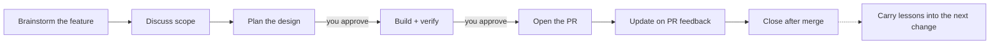

<p align="center">
  
</p>

<p align="center">
  A spec-driven workflow for AI coding agents: discuss the idea, plan the design,
  build the change, and open the PR without losing context.
</p>

<p align="center">
  <a href="#license"></a>
  <a href="CHANGELOG.md"></a>
  <a href="cli/Cargo.toml"></a>
</p>

<p align="center">
  <b>English</b> | <a href="README.ja.md">日本語</a>
</p>

---

MochiFlow helps AI coding agents work like a disciplined teammate instead of
jumping straight into code.

- **Shape ideas before coding** — turn rough feature requests into scoped specs.
- **Keep the agent on the rails** — design approval before implementation, PR approval before opening.
- **Carry knowledge forward** — decisions and pitfalls are recorded for the next change.

No external runtime. MochiFlow ships as a single Rust binary.

## Quick start

Install MochiFlow:

```bash
# Homebrew, recommended on macOS / Linux
brew install ELUNOX/tap/mochiflow

# Shell installer
curl --proto '=https' --tlsv1.2 -LsSf \
  https://github.com/ELUNOX/mochiflow/releases/download/v1.1.3/mochiflow-cli-installer.sh | sh

# From source
git clone https://github.com/ELUNOX/mochiflow.git
cd mochiflow
cargo install --path cli/crates/mochiflow-cli
```

Set it up in a project:

```bash
cd /path/to/project
mochiflow init
```

If setup needs project-specific judgment, `init` prints a prompt for your AI
agent. Paste it into the agent to finish onboarding, then run:

```bash
mochiflow doctor
```

When `doctor` passes, your AI tool has the project context and workflow
instructions it needs.

Useful terminal commands:

```bash
mochiflow guide                         # print the AI-tool usage card
mochiflow config show                   # inspect resolved paths, language, surfaces, and git
mochiflow lint [--spec SLUG]            # check spec consistency
mochiflow doctor [config|specs|adapter|engine]
mochiflow adapter generate [--check]
mochiflow pr --spec SLUG --title "..." --body-file PATH
```

## Artifact model

MochiFlow keeps state in files, not in chat history. A spec lives under
`.mochiflow/specs/{slug}/` and grows only as much structure as the change needs:

| Artifact | Role |
| --- | --- |
| `spec.md` | Product contract: problem, goal, scope, acceptance criteria, QA scenarios, non-functional requirements, and verification plan. |
| `design.md` | Technical contract: decisions, alternatives, interface contracts, failure modes, rollout / rollback, observability, and test strategy. |
| `tasks.md` | Executable checklist: dependency-ordered tasks an AI agent can run and verify. |
| AC Matrix | Traceability ledger inside `spec.md`: AC → implementation → verification → evidence → result. |

Small patches skip spec artifacts. Normal work uses `discuss → plan → build →
open`, then `update` (PR feedback) and `close` (after merge); only two delivery
approvals exist: approval to build, and approval of the PR content before the PR
is opened.

For a repository where MochiFlow is already tracked by the team, do not run a
fresh setup. Cloning or pulling brings down the vendored engine and AI-tool
entrypoints. If local runtime state, adapters, or `INDEX.md` need repair, run:

```bash
mochiflow join
```

`join` repairs local generated state such as `.mochiflow/state/`, can restore a
missing `.mochiflow/engine/` for older or broken worktrees, and refreshes the
AI-tool entrypoints and `INDEX.md` when needed.

## CLI commands

MochiFlow's public CLI commands are:

| Command | Purpose |
| --- | --- |
| `mochiflow init` | Bootstrap MochiFlow into a project. |
| `mochiflow join` | Restore local generated state for an existing MochiFlow project. |
| `mochiflow detach` | Remove generated integration while preserving project knowledge by default. |
| `mochiflow guide` | Print the usage-vocabulary card for the AI workflow. |
| `mochiflow config` | Inspect or validate project configuration. |
| `mochiflow lint` | Check specs for consistency. |
| `mochiflow doctor` | Run quality gates for config, specs, adapters, and engine integrity. |
| `mochiflow adapter` | Generate AI-tool adapter entrypoints. |
| `mochiflow index` | Regenerate or check `INDEX.md` and state index output. |
| `mochiflow status` | Render the live delivery board (Backlog / Active / Ready / In Review / Done); read-only. |
| `mochiflow ready` | Check whether a spec can enter implementation. |
| `mochiflow accept` | Settle the accept close-out: set `accepted`, stage the spec and ADR fold, and commit. |
| `mochiflow backlog` | List, show, or validate backlog seeds. |
| `mochiflow upgrade` | Replace the installed engine while preserving project data. |
| `mochiflow freeze` | Regenerate derived version/integrity files from the workspace version. |
| `mochiflow pr` | Run PR pre-flight, push, and provider/manual PR handoff. |
| `mochiflow completions` | Generate shell completion scripts. |

For initialized projects, `mochiflow doctor` is the project health check. In the
MochiFlow source repo, run `mochiflow freeze --check` as the separate
derived-file coherence check; scripts can use
`mochiflow freeze --root <source-repo> --check` when they cannot rely on the
current working directory.

## What `init` creates

`mochiflow init` adds a `.mochiflow/` workspace and generates the entrypoint
files your AI tool reads.

```text
.mochiflow/
  config.toml        # project settings, adapters, verification commands
  engine/            # vendored workflow engine tracked with the project
  constitution.md    # always-loaded project rules written by you
  context/           # current project map, filled from code during onboarding
  specs/             # feature specs created by the workflow
  adr/               # decisions and pitfalls carried into future work

AGENTS.md / CLAUDE.md / .kiro/ / .github/
  # generated entrypoints for your AI coding tool
```

During onboarding, your AI agent resolves TODOs, fills project context from the
codebase, regenerates adapters, and finishes by checking `mochiflow doctor`.

To temporarily remove the project integration, run `mochiflow detach`. It
removes generated adapter content plus `.mochiflow/state/`, while preserving the
tracked engine, config, specs, ADR, context, and constitution files so
`mochiflow join` can repair the integration later. Use
`mochiflow detach --purge --confirm "delete mochiflow data"` only when you want
to delete all MochiFlow project data.

## What working with MochiFlow feels like

Imagine you want to add saved filters to a search page.

You can start naturally in your AI tool:

```text
I want to add saved filters to the search page. Before coding, help me think
through the scope, edge cases, and design options.
```

Or you can use an explicit MochiFlow trigger when you want a precise handoff:

```text
mochiflow-discuss

I want users to save search filters and reuse them later.
```

Both styles enter the same flow:



Next, ask the agent to turn the discussion into a design:

```text
mochiflow-plan
```

The agent writes a design document under `.mochiflow/specs/...` and waits for
your approval. Depending on depth, this includes `spec.md`, `tasks.md`, and
`design.md`; nothing is implemented yet.

When the plan looks right:

```text
mochiflow-build
```

The agent implements the plan, updates tests, runs the configured verification
command, updates the AC Matrix, and reports what changed.

When you are ready to open the PR:

```text
mochiflow-open
```

MochiFlow runs acceptance, records the important decisions and pitfalls, sets the
spec to `accepted`, and — after you approve the PR content — opens the PR through
the project's PR path.

When PR review asks for changes:

```text
mochiflow-update
```

The agent applies the feedback through the build loop, re-verifies, pushes, and
refreshes the PR. The spec stays in place; nothing is reverted or archived.

After the PR merges:

```text
mochiflow-close
```

MochiFlow does local cleanup only — switch back to the base branch, fast-forward,
delete the local branch, and refresh the board. It writes nothing to the base
branch.

`mochiflow-discuss`, `mochiflow-plan`, `mochiflow-build`, `mochiflow-open`,
`mochiflow-update`, and `mochiflow-close` are messages for your AI tool, not
terminal commands.

## Supported tools

| Tool | How it integrates |
| --- | --- |
| Kiro | Always-on steering (`.kiro/steering/mochiflow.md`) + read-only reviewer and write-capable per-task build-worker agents |
| Claude Code | Generates `CLAUDE.md` |
| GitHub Copilot | Generates `.github/` integration |
| Generic agents | Generates `AGENTS.md` |

Pick tools with `--adapter` during init. Regenerate anytime with
`mochiflow adapter generate`; existing Markdown instruction files keep their
custom content and receive a MochiFlow-managed block.

Remove generated adapter content and runtime state with `mochiflow detach`.
This preserves the tracked engine and project knowledge by default; `--purge`
requires the exact confirmation phrase `delete mochiflow data`.

## Learn more

- [Getting started](docs/getting-started.md)
- [Concepts](docs/concepts.md)
- [Configuration](docs/configuration.md)
- [Versioning](docs/versioning.md)
- [Release verification](docs/release-verification.md)
- [Changelog](CHANGELOG.md)

## Contributing

Contributions are welcome. See [CONTRIBUTING.md](CONTRIBUTING.md) for the dev
setup, tests, and PR conventions, and the
[Code of Conduct](CODE_OF_CONDUCT.md) for community standards.

## Security

Report vulnerabilities using the process in [SECURITY.md](SECURITY.md).

## License

Licensed under either [MIT](LICENSE-MIT) or [Apache-2.0](LICENSE-APACHE), at
your option.
