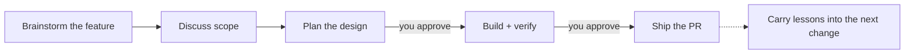

<p align="center">
  
</p>

<p align="center">
  A spec-driven workflow for AI coding agents: discuss the idea, plan the design,
  build the change, and ship the PR without losing context.
</p>

<p align="center">
  <a href="#license"></a>
  <a href="CHANGELOG.md"></a>
  <a href="cli/Cargo.toml"></a>
</p>

<p align="center">
  <b>English</b> | <a href="README.ja.md">日本語</a>
</p>

---

MochiFlow helps AI coding agents work like a disciplined teammate instead of
jumping straight into code.

- **Shape ideas before coding** — turn rough feature requests into scoped specs.
- **Keep the agent on the rails** — design approval before implementation, PR approval before shipping.
- **Carry knowledge forward** — decisions and pitfalls are recorded for the next change.

No external runtime. MochiFlow ships as a single Rust binary.

## Quick start

Install MochiFlow:

```bash
# Homebrew, recommended on macOS / Linux
brew install ELUNOX/tap/mochiflow

# Shell installer
curl --proto '=https' --tlsv1.2 -LsSf \
  https://github.com/ELUNOX/mochiflow/releases/download/v1.1.0/mochiflow-cli-installer.sh | sh

# From source
git clone https://github.com/ELUNOX/mochiflow.git
cd mochiflow
cargo install --path cli/crates/mochiflow-cli
```

Set it up in a project:

```bash
cd /path/to/project
mochiflow init
```

If setup needs project-specific judgment, `init` prints a prompt for your AI
agent. Paste it into the agent to finish onboarding, then run:

```bash
mochiflow doctor
```

When `doctor` passes, your AI tool has the project context and workflow
instructions it needs.

## What `init` creates

`mochiflow init` adds a `.mochiflow/` workspace and generates the entrypoint
files your AI tool reads.

```text
.mochiflow/
  config.toml        # project settings, adapters, verification commands
  constitution.md    # always-loaded project rules written by you
  context/           # current project map, filled from code during onboarding
  specs/             # feature specs created by the workflow
  adr/               # decisions and pitfalls carried into future work

AGENTS.md / CLAUDE.md / .kiro/ / .github/
  # generated entrypoints for your AI coding tool
```

During onboarding, your AI agent resolves TODOs, fills project context from the
codebase, regenerates adapters, and finishes by checking `mochiflow doctor`.

## What working with MochiFlow feels like

Imagine you want to add saved filters to a search page.

You can start naturally in your AI tool:

```text
I want to add saved filters to the search page. Before coding, help me think
through the scope, edge cases, and design options.
```

Or you can use an explicit MochiFlow trigger when you want a precise handoff:

```text
mochiflow-discuss

I want users to save search filters and reuse them later.
```

Both styles enter the same flow:



Next, ask the agent to turn the discussion into a design:

```text
mochiflow-plan
```

The agent writes a design document under `.mochiflow/specs/...` and waits for
your approval. Nothing is implemented yet.

When the plan looks right:

```text
mochiflow-build
```

The agent implements the plan, updates tests, runs the configured verification
command, and reports what changed.

When you are ready to open the PR:

```text
mochiflow-ship
```

MochiFlow records the important decisions and pitfalls, then follows the
project's PR path.

`mochiflow-discuss`, `mochiflow-plan`, `mochiflow-build`, and `mochiflow-ship`
are messages for your AI tool, not terminal commands.

## Supported tools

| Tool | How it integrates |
| --- | --- |
| Kiro | Generates dedicated agents and steering |
| Claude Code | Generates `CLAUDE.md` |
| GitHub Copilot | Generates `.github/` integration |
| Generic agents | Generates `AGENTS.md` |

Pick tools with `--adapter` during init. Regenerate anytime with
`mochiflow adapter generate`; existing Markdown instruction files keep their
custom content and receive a MochiFlow-managed block.

## Learn more

- [Getting started](docs/getting-started.md)
- [Concepts](docs/concepts.md)
- [Configuration](docs/configuration.md)
- [Versioning](docs/versioning.md)
- [Release verification](docs/release-verification.md)
- [Changelog](CHANGELOG.md)

## Contributing

Contributions are welcome. See [CONTRIBUTING.md](CONTRIBUTING.md) for the dev
setup, tests, and PR conventions, and the
[Code of Conduct](CODE_OF_CONDUCT.md) for community standards.

## Security

Report vulnerabilities using the process in [SECURITY.md](SECURITY.md).

## License

Licensed under either [MIT](LICENSE-MIT) or [Apache-2.0](LICENSE-APACHE), at
your option.
