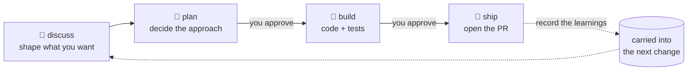

<p align="center">
  
</p>

<p align="center">
  Hand your AI coding agent a rough idea, and MochiFlow walks it through
  shaping the spec, designing, implementing, and opening the PR — in a
  disciplined, repeatable flow.
</p>

<p align="center">
  <a href="#license"></a>
  <a href="CHANGELOG.md"></a>
  <a href="cli/Cargo.toml"></a>
</p>

<p align="center">
  <b>English</b> | <a href="README.ja.md">日本語</a>
</p>

---

Letting an AI write code tends to go sideways: it jumps straight to
implementation and drifts off track, forgets last week's decisions and repeats
the same mistakes, and behaves differently in every tool. MochiFlow gives your
AI agent a consistent way of working — **discuss → plan → build → ship** —
**carries the knowledge it gained into the next change**, and lets you work the
**same way across any AI tool**.

## What you can do

- 🗣 **Turn an idea into a spec** — Say "I want a feature like this," and MochiFlow organizes the points, trade-offs, and scope, and agrees with you *before* any code is written.
- 🧭 **Keep implementation from running away** — It never barrels to the finish on its own; it checks in with you exactly twice ("design OK?" and "ship the PR?").
- 🧠 **Never lose past decisions** — The *why* behind a choice and the pitfalls hit along the way are recorded at ship time and surfaced automatically on the next change.
- 🔁 **Keep code and knowledge in sync** — Current state is always re-read from the code, so stale docs never mislead a decision.
- 🧩 **Same flow, any tool** — Kiro, Claude Code, GitHub Copilot, and a generic `AGENTS.md` all get the same way of working, generated automatically.
- ⚙️ **Scale rigor to risk** — The bigger a change's blast radius, the stricter the review cadence and commit granularity become, automatically.
- 📦 **All the way to the PR** — `git push` and PR creation are handled through one safe path.

No external runtime. It ships as a single Rust binary.

## How it works

Say "I want to add pagination to the user list," and MochiFlow runs it through:



1. **discuss** — Work out the requirements, edge cases, and fit with existing code together.
2. **plan** — It proposes the approach and waits for your approval (no implementing on its own).
3. **build** — It writes the code and tests and gets verification to pass.
4. **ship** — It opens the PR and records *why* this design was chosen, so the next change benefits.

You make decisions at just two points — ② and ④. MochiFlow keeps everything on the rails in between.

## Quick start

### Install

Homebrew (recommended):

```bash
brew install ELUNOX/tap/mochiflow
```

Shell installer (Linux / macOS) — copy the exact command from the
[latest release](https://github.com/ELUNOX/mochiflow/releases). For a pinned
install, use the versioned URL, e.g.:

```bash
curl --proto '=https' --tlsv1.2 -LsSf https://github.com/ELUNOX/mochiflow/releases/download/v1.1.0/mochiflow-cli-installer.sh | sh
```

From source (requires a Rust toolchain):

```bash
cargo install --path cli/crates/mochiflow-cli
```

> **macOS:** binaries installed via `brew` or the shell installer run without a
> Gatekeeper prompt. If you download a release tarball with a web browser and
> macOS blocks it, clear the quarantine flag once: `xattr -d com.apple.quarantine ./mochiflow`.

### Verify a download (optional)

Every release ships SHA256 checksums and SLSA build provenance:

```bash
# integrity
shasum -a 256 -c mochiflow-cli-<target>.tar.xz.sha256
# provenance (requires the GitHub CLI)
gh attestation verify mochiflow-cli-<target>.tar.xz --repo ELUNOX/mochiflow
```

### Set up a project

```bash
cd /path/to/project
mochiflow init
```

`init` asks for an adapter and project language on an interactive terminal. The
adapter defaults to `agents`; the language defaults from your locale (`ja` for a
Japanese locale, otherwise `en`). For CI or scripts, use `mochiflow init --yes`;
it asks no questions, uses the same locale-based language default, and marks
anything uncertain for review. To pin the language explicitly, run
`mochiflow init --language ja` or `mochiflow init --language en`.

If the result is `Ready`, config, context, and adapters are usable. If it is
`Needs AI review`, paste the exact prompt printed by `init` into your AI agent;
it tells the agent which `# mochiflow: confirm` / `TODO` items to resolve, how
to fill project context from code, and to finish with `mochiflow doctor`.
If the result is `Blocked`, an existing hand-written adapter file needs a manual
candidate merge; `init` exits `1` so scripts can detect it.

Example `Needs AI review` next step:

```text
Paste this into your AI agent:

Complete MochiFlow setup for this repository. Read .mochiflow/config.toml,
resolve every "# mochiflow: confirm" and TODO item with me, fill
.mochiflow/context/product.md, .mochiflow/context/structure.md, and
.mochiflow/context/tech.md from the code,
adjust surfaces / verify / write scope / git settings if needed, regenerate
adapters, and finish with mochiflow doctor.
```

From then on, just tell your usual AI tool "I want to implement X" — MochiFlow
keeps the flow in order.

## Supported tools

| Tool | How it integrates |
| --- | --- |
| Kiro | Generates dedicated agents / steering |
| Claude Code | Generates `CLAUDE.md` |
| GitHub Copilot | Generates `.github/` integration |
| Generic agents | Generates `AGENTS.md` |

Pick tools with `--adapter` at init time (repeatable / comma-separated). The
`codex` alias resolves to the neutral `agents` adapter. Regenerate anytime with
`mochiflow adapter generate`.

## Learn more

<details>
<summary>How it works under the hood, and the vocabulary (click to expand)</summary>

MochiFlow drives the AI through four stages (**verbs**: discuss / plan / build /
ship). What it learns is accumulated in a **living spec**: the *why* is appended
at ship time (**fold**), while your AI agent can regenerate the project's
current-state map from code when it becomes stale (**refresh**). Each change is assigned a **risk** level (`standard` /
`elevated` / `critical`) that scales review cadence and commit granularity, and
the per-tool integration output (**adapter**) is generated from a single config.

Core invariants:

- Code is the source of truth for current state; prose never overrides code.
- There are exactly two human gates (approve-to-build, approve-PR); only `ship` sets a change to `done`.
- `git push` and PR creation always go through `mochiflow pr`.
- The contract surface is frozen by `contracts.lock`; changing a schema requires regenerating the lock and bumping `engine/VERSION` in the same commit.

CLI commands:

```
mochiflow init | config | lint | doctor | adapter | index | ready | backlog | upgrade | completions | pr
```

</details>

<details>
<summary>Configuration, gitignore, and upgrading the engine</summary>

### Configuration

`mochiflow init` writes a schema-valid skeleton into `<target>/.mochiflow/`
without touching your source tree. The project is `Ready` only when config,
context, and adapters are all complete. When project-specific judgement is still
required, `init` reports `Needs AI review` and prints the exact prompt to give
your agent so it can resolve `.mochiflow/config.toml`, fill
`.mochiflow/context/product.md`, `.mochiflow/context/structure.md`, and
`.mochiflow/context/tech.md` from code, regenerate adapters, and run
`mochiflow doctor`. If adapter files need a manual
candidate merge, `init` reports `Blocked` and exits `1`.

For non-interactive setup:

```bash
mochiflow init --yes
```

To choose the language without a prompt:

```bash
mochiflow init --language ja
```

### What to gitignore

The rule is "regenerated or runtime-derived → ignore; authored knowledge →
track":

```gitignore
# Regenerated / runtime — do not track
.mochiflow/engine/   # vendored engine copy (restored by init/upgrade)
.mochiflow/state/    # runtime-derived state
```

Track the rest — `.mochiflow/config.toml`, `.mochiflow/specs/`,
`.mochiflow/context/`, `.mochiflow/adr/`, and `.mochiflow/INDEX.md`.

### Upgrade the engine

```bash
# From the target project root
mochiflow upgrade
mochiflow doctor
```

After updating the installed CLI, `mochiflow upgrade` replaces the project's
vendored engine with the engine bundled into the CLI, regenerates adapters, and
preserves `config.toml`, specs, and the living spec. `--source /path/to/engine`
is available for development and dogfood workflows. The installed engine's own
`VERSION` and `MANIFEST.json` record the active engine version and integrity
baseline. See [CHANGELOG.md](CHANGELOG.md) for per-version migration notes.

</details>

<details>
<summary>Project layout and versioning</summary>

```
cli/           # Rust CLI workspace (mochiflow-cli + mochiflow-core)
engine/        # Project-agnostic core (commands/reference/templates/agents/adapters)
contracts/     # Frozen schemas (config / spec.yaml v1 / MANIFEST) + semantics prose
tests/         # Conformance: golden fixtures + schema fixtures (consumed by `cargo test`)
```

- `mochiflow --version` — product / CLI version.
- `engine/VERSION` — source engine and contract-surface semver.
- `.mochiflow/engine/VERSION` — installed engine version used by adapters, `config show`, and `doctor engine`.
- `.mochiflow/engine/MANIFEST.json` — installed engine integrity baseline; its `version` matches the installed `VERSION`.
- `schema_version` in `config.toml` — config file-format compatibility; users do not edit it during normal upgrades.

</details>

## Contributing

Contributions are welcome. See [CONTRIBUTING.md](CONTRIBUTING.md) for the dev
setup, tests, and PR conventions, and the
[Code of Conduct](CODE_OF_CONDUCT.md) for community standards.

## Security

To report a vulnerability, see [SECURITY.md](SECURITY.md).

## License

Dual-licensed under either [MIT](LICENSE-MIT) or [Apache-2.0](LICENSE-APACHE),
at your option.
